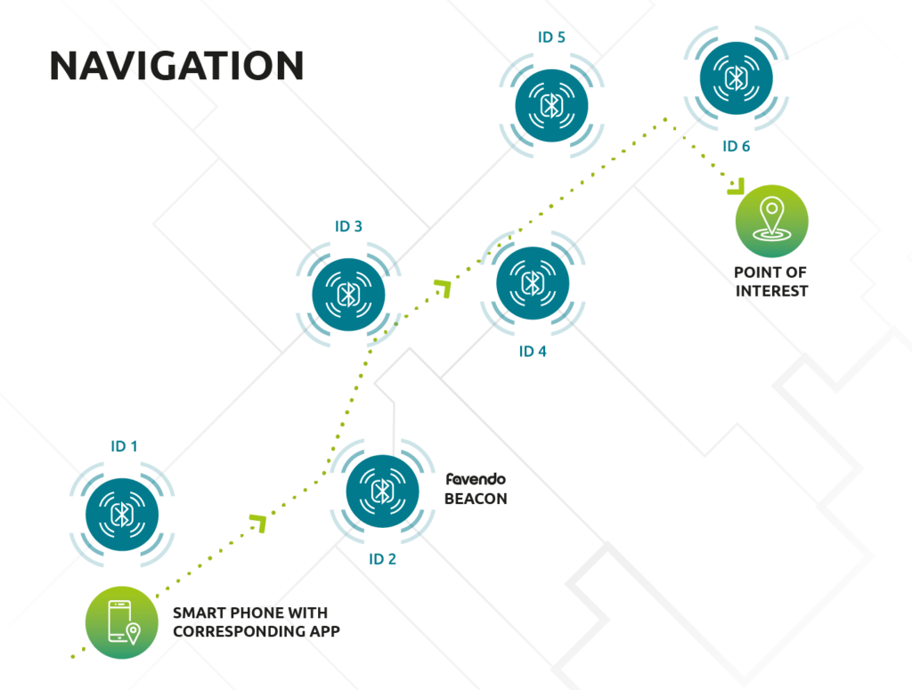

# Category-Recommender-for-Navigation-POIs
Offers the most probable categories for uncategorized places (Points of Interest in navigation apps)

Point of Interest (POI) is a feature that is widely used in navigating and mapping applications to highlight important locations to users. 
They can be gathered from different sources, such as operator investigations, governmental databases, or public reports. 
Multiple users may save the same POI report with different information, leading to a duplicate POI, or they may leave some features blank, such as the category.

During data preprocessing, I will detect duplicate rows and merge them into a more complete row.
For the locations in the dataset that are not categorized, this project aims to make category predictions. 
To do this, I have used the Nearest Neighbor method, and results are evaluated By utilizing the HIT RATE metric.
This project uses datasets provided by the Balad navigation app in Farsi.

